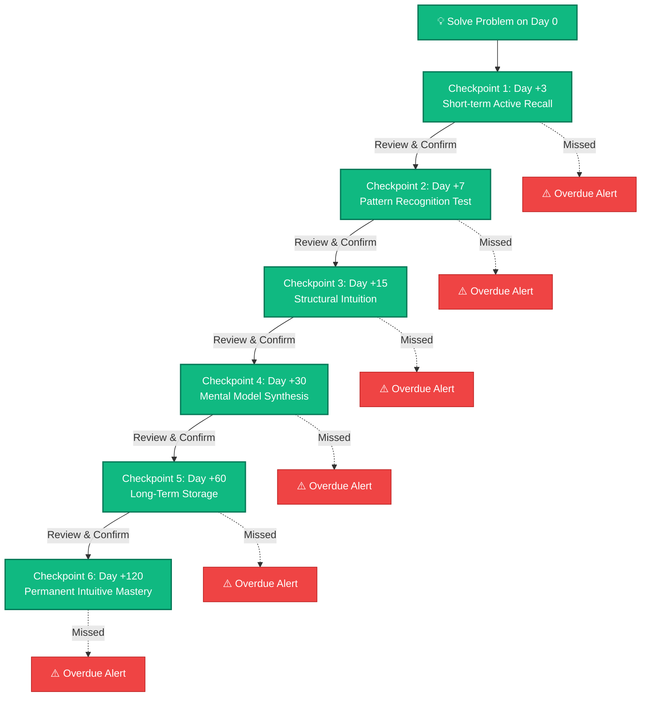
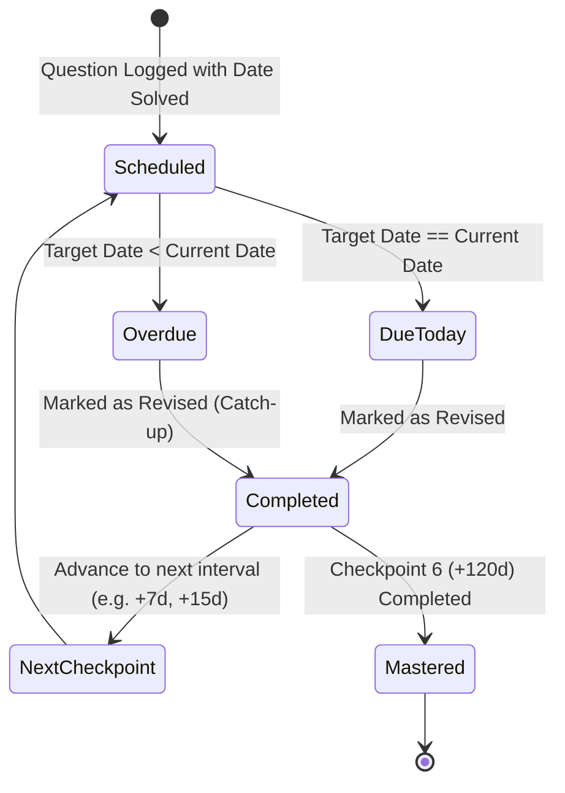
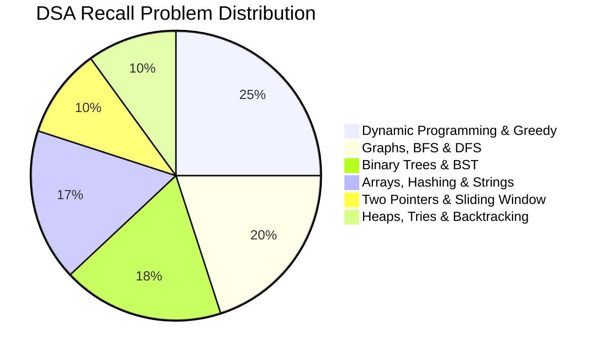

# 💎 DSA Recall

<div align="center">


<br />
**A macOS & iOS Liquid Glass Spaced-Repetition System for Mastering Data Structures & Algorithms**

[](https://nextjs.org/)
[](https://react.dev/)
[](https://www.typescriptlang.org/)
[](https://tailwindcss.com/)
[](https://opensource.org/licenses/MIT)
[](#offline-first-architecture)

[Features](#-key-features) • [Cognitive Science](#-the-cognitive-science-ebbinghaus-curve) • [Graphs & Diagrams](#-graphs--architecture-diagrams) • [Schedule Formula](#-spaced-repetition-schedule) • [Getting Started](#-getting-started) • [Contributing](#-contributing)

</div>

---

## 📖 Overview

**DSA Recall** is an offline-first spaced-repetition tracking application designed specifically for software engineers, students, and competitive programmers tackling Data Structures and Algorithms.

Solving a LeetCode problem once creates **temporary familiarity**, not **permanent intuition**. According to cognitive psychology, learners forget over **70% of new problem-solving patterns within 48 hours** if unreviewed.

DSA Recall automates the scientific intervals of spaced practice (**+3, +7, +15, +30, +60, +120 days**), systematically scheduling revision checkpoints that intercept the forgetting curve at precisely the moment memory decay begins. Wrapped in an authentic **Apple macOS & iOS Liquid Glass** aesthetic with frosted acrylic surfaces, specular edge highlights, and fluid micro-interactions, DSA Recall turns high-stress interview prep into an organized, satisfying habit.

---

## 🧠 The Cognitive Science: Ebbinghaus Curve

Human memory follows an exponential decay described by **Dr. Hermann Ebbinghaus's Forgetting Curve**. Each time a concept is actively recalled at increasing intervals, the rate of decay flattens.

```text
Memory Retention (%)
100% |  [Day 0: Solved]
     |   \
 80% |----\---[Day 3 Review]
     |     \   \
 60% |------\---\---[Day 7 Review]
     |       \   \   \
 40% |  Unreviewed\   \---[Day 15 Review]
     |  Problem    \   \   \
 20% |  (Decays to  \   \   \---[Day 30 Review] ---> 95%+ Permanent Retention
  0% +------------------------------------------------------------------------> Time (Days)
     0    2    4    6    8   10   15   20   25   30   45   60   90   120
```

---

## 📊 Graphs & Architecture Diagrams

### 1. Memory Consolidation Flowchart



---

### 2. Spaced Repetition Lifecycle State Machine



---

### 3. Application Architecture (Offline-First)

```mermaid
flowchart LR
    subgraph ClientUI["🍏 Liquid Glass Interface"]
        Dashboard["Dashboard View"]
        QuestionsTable["Modern & Excel Tables"]
        HeatmapComp["371-Day Activity Heatmap"]
        PracticeHub["Topic Practice Hub"]
        Achievements["Milestone Sharing"]
    end

    subgraph StateEngine["⚡ Core State & Context"]
        QuestionsCtx["useQuestions() Provider"]
        ScheduleEngine["Revision Scheduler Engine"]
        AnalyticsEngine["Streak & Velocity Analytics"]
        PresetManager["Interval Customizer"]
    end

    subgraph StorageLayer["🔒 Zero-Cloud Persistence"]
        LocalStore[("Browser LocalStorage")]
        BackupIO["JSON / CSV Importer & Exporter"]
    end

    ClientUI <--> StateEngine
    StateEngine <--> StorageLayer
```



---

### 4. Curated DSA Topic Distribution



---

### 5. Checkpoint Progress Timeline (Per Question)

```mermaid
gantt
    title Standard 120-Day Recall Timeline for a Solved Question
    dateFormat  X
    axisFormat Day %s

    section Day 0
    Initial Solution Solved      :done, d0, 0, 1
    section Checkpoints
    +3 Days Review (Recall)      :active, c1, 1, 3
    +7 Days Review (Pattern)     :c2, 3, 7
    +15 Days Review (Technique)  :c3, 7, 15
    +30 Days Review (Edge Cases) :c4, 15, 30
    +60 Days Review (Retention)  :c5, 30, 60
    +120 Days (Permanent Mastery):c6, 60, 120
```



---

## 🗓️ Spaced Repetition Schedule

When a question is added, **DSA Recall** automatically calculates all 6 revision dates relative to `dateSolved`. **The user never has to enter revision dates manually.**

| Checkpoint | Offset | Cognitive Objective | Target Retention Rate |
|:---|:---:|:---|:---:|
| **Round 1** | **+3 days** | Counteract immediate post-solution forgetting; test active recall without code peeking. | **90%** |
| **Round 2** | **+7 days** | Cement pattern identification (e.g., Two Pointers vs Sliding Window). | **88%** |
| **Round 3** | **+15 days** | Test retrieval speed and dry-run execution on edge cases. | **85%** |
| **Round 4** | **+30 days** | Validate long-term mental model; write optimal solution from blank canvas. | **92%** |
| **Round 5** | **+60 days** | Confirm cross-topic retrieval and time-complexity intuition under pressure. | **95%** |
| **Round 6** | **+120 days** | Complete consolidation into permanent algorithmic instinct. | **98%+** |

> [!NOTE]
> If a question's `dateSolved` is modified, all 6 checkpoints are automatically recalculated. Completed revision logs are preserved safely.

---

## ✨ Key Features

### 🍏 Authentic macOS & iOS Liquid Glass UI
- **Translucent Frosted Acrylics**: `backdrop-filter: blur(28px) saturate(190%)` with iridescent ambient light refraction.
- **Specular Edge Highlights**: Multi-layered inner specular glow (`inset 0 1px 1.5px rgba(255,255,255,0.95)`).
- **macOS Window Sheets**: Authentic traffic light window controls (Red `#FF5F56`, Amber `#FFBD2E`, Green `#27C93F`).
- **Apple Typography**: Native San Francisco font stack (`-apple-system, BlinkMacSystemFont, "SF Pro Display"`).

### 📅 Automated Revision Management
- **Dashboard Action Center**: Real-time counters for Due Today, Overdue, Upcoming, and Completed checkpoints.
- **One-Click Checkpoint Completion**: Mark questions as revised directly from the dashboard or dedicated revision views.
- **Streak & Habit Engine**: Daily tracking that monitors current streak, longest streak, and total completed sessions.

### 📊 Visual Analytics & Velocity
- **GitHub-Style 371-Day Activity Heatmap**: Visualizes annual revision consistency with hoverable daily metrics.
- **30-Day Activity Sparkline**: Smooth cubic Bézier velocity curve tracking completed revisions over the last month.
- **Revision Breakdown Bar**: Instant proportional status distribution across Completed, Upcoming, Due Today, and Overdue items.

### 📋 Dual Table Views
- **Modern Liquid Glass Table**: Card-style interactive view with difficulty badges, topic tags, and action menus.
- **Excel Spreadsheet View**: High-density horizontal grid with sticky column pinning for rapid bulk inspection.

### 🎯 Topic-Wise Practice Hub
- Curated catalog of essential DSA questions categorized across **Dynamic Programming**, **Graphs**, **Binary Trees**, **Arrays**, **Binary Search**, and **Heaps**.
- Filter by difficulty (Easy, Medium, Hard), topic, or search term.
- Direct links to original LeetCode problems with an instant *"Add to Tracker"* workflow.

### 🏆 Achievements & Social Sharing
- **12+ Unlockable Milestones**: "First Recall", "Week Warrior", "Centurion", "Tree Hugger", "DP Master", etc.
- **Share to LinkedIn & Twitter/X**: Generates an aesthetic milestone preview card and one-click formatted post text ready to publish.

### ⚙️ Customizable Intervals & Settings
- Switch between **Standard (3, 7, 15, 30, 60, 120)**, **Aggressive (1, 3, 7, 14, 30)**, or create custom revision days.
- User profile personalization and storage statistics.

### 🔒 100% Offline-First & Private
- All questions, revision schedules, and completion logs stay strictly inside your browser's `localStorage`.
- No account, no database, no internet required.
- **Backup & Portability**: Export your full dataset to formatted JSON or spreadsheet-friendly CSV with one click.

---

## 🛠️ Tech Stack

| Technology | Purpose |
|:---|:---|
| **Next.js 16 (App Router)** | React framework with server-side rendering and client streaming |
| **React 19** | Component architecture and state primitives |
| **TypeScript 5** | Strict type safety for data models and revision arithmetic |
| **Tailwind CSS v4** | Modern utility-first styling with custom Liquid Glass tokens |
| **Lucide React** | Clean, minimalist iconography |
| **Canvas Confetti** | Celebration micro-animations on milestone unlocks |
| **Web Storage API** | Ultra-fast client-side persistence |

---

## 📁 Project Structure

```text
DSARecall/
├── src/
│   ├── app/
│   │   ├── layout.tsx              # Root HTML layout with Apple San Francisco stack
│   │   ├── globals.css             # Liquid Glass design tokens, ambient mesh & styles
│   │   ├── page.tsx                # Main Dashboard with StatCards, Heatmap & Action center
│   │   ├── questions/
│   │   │   ├── page.tsx            # Questions list with filter toolbar & dual view modes
│   │   │   └── [id]/page.tsx       # Detailed question profile with interactive timeline
│   │   ├── practice/page.tsx       # Curated topic-wise problem catalog
│   │   ├── achievements/page.tsx   # Milestone badges & LinkedIn/Twitter sharing
│   │   ├── settings/page.tsx       # Schedule interval customizer & profile preferences
│   │   ├── today/page.tsx          # Dedicated actionable revisions for the current date
│   │   ├── upcoming/page.tsx       # Future revision schedule agenda
│   │   ├── overdue/page.tsx        # High-priority overdue catch-up list
│   │   └── revisions/page.tsx      # Chronological revision timeline
│   ├── components/
│   │   ├── Sidebar.tsx             # macOS acrylic sidebar with traffic light controls
│   │   ├── TopBar.tsx              # Liquid glass breadcrumb & action capsule
│   │   ├── StatCard.tsx            # Specular metric card with trend indicators
│   │   ├── RevisionHeatmap.tsx     # 371-day GitHub-style emerald activity grid
│   │   ├── ActivityChart.tsx       # 30-day Bézier line chart with radiant gradient fill
│   │   ├── StatusBreakdown.tsx     # Multi-status horizontal checkpoint visualizer
│   │   ├── QuestionsTable.tsx      # Interactive desktop table with search & filters
│   │   ├── SpreadsheetTable.tsx    # Excel-style horizontal revision checkpoint table
│   │   ├── AddQuestionModal.tsx    # macOS sheet modal for logging solved problems
│   │   ├── ImportExportModal.tsx   # JSON/CSV backup and restore interface
│   │   └── ShareAchievementModal.tsx # Social media preview card with copyable snippet
│   └── lib/
│       ├── types.ts                # TypeScript schemas for Questions, Logs & Intervals
│       ├── dates.ts                # ISO date manipulation & revision math functions
│       ├── context.tsx             # Global application state with localStorage sync
│       ├── analytics.ts            # Streak calculation, velocity & heatmap aggregator
│       ├── practiceData.ts         # Curated list of top DSA problems with metadata
│       ├── achievements.ts         # Milestone criteria & social share generators
│       └── seed.ts                 # Dummy demonstration data for instant visual preview
├── public/                         # Static assets & icons
├── package.json                    # Project dependencies & build scripts
└── README.md                       # Documentation
```

---

## 🚀 Getting Started

### Prerequisites

- **Node.js**: `v18.17.0` or higher
- **npm**, **pnpm**, or **yarn**

### Installation

1. **Clone the repository:**
   ```bash
   git clone https://github.com/MdKasifuddin/DSARecall.git
   cd DSARecall
   ```

2. **Install dependencies:**
   ```bash
   npm install
   ```

3. **Start the local development server:**
   ```bash
   npm run dev
   ```

4. **Open in browser:**
   Navigate to [http://localhost:3000](http://localhost:3000) to start tracking your DSA revisions.

### Building for Production

To create an optimized production build:

```bash
npm run build
npm run start
```

---

## 💾 Backup & Data Migration

Because **DSA Recall** is 100% offline-first, your data belongs exclusively to you:

- **Export Backup**: Click **"Backup / Export"** in the sidebar to download your full history as a `.json` backup file.
- **Export to Spreadsheet**: Download a `.csv` file directly importable into Microsoft Excel, Google Sheets, or Apple Numbers.
- **Restore / Migrate**: Drop any previous `.json` backup file onto the upload zone to restore your questions, schedules, and completion logs across devices.

---

## 🤝 Contributing

Contributions, feedback, and feature suggestions are welcome!

1. Fork the repository
2. Create your feature branch (`git checkout -b feature/AmazingFeature`)
3. Commit your changes (`git commit -m 'Add some AmazingFeature'`)
4. Push to the branch (`git push origin feature/AmazingFeature`)
5. Open a Pull Request

---

## 📄 License

Distributed under the **MIT License**. See `LICENSE` for more information.

---

<div align="center">

Crafted with 💚 for engineers striving for algorithmic mastery.

</div>
